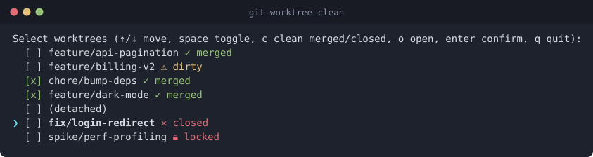
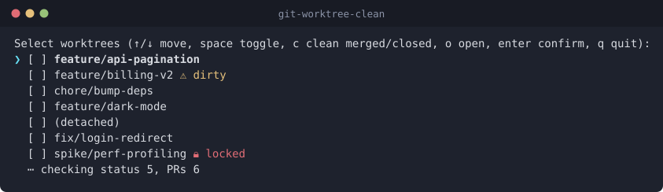
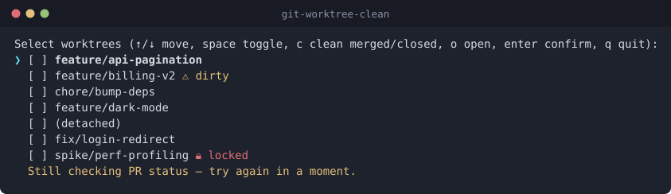
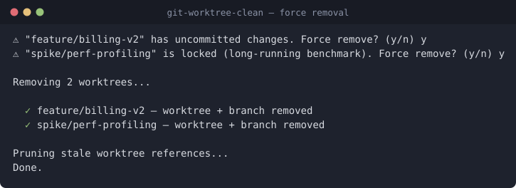
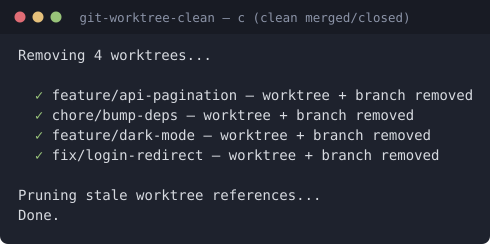
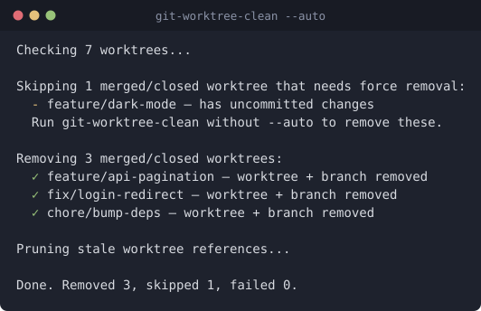

# git-worktree-clean

An interactive CLI tool for cleaning up [git worktrees](https://git-scm.com/docs/git-worktree). Lists your worktrees, lets you select which ones to remove, and deletes the associated branches — all with a custom terminal UI. Also doubles as a worktree picker: hit `o` on any row to `cd` your shell straight into that worktree. For unattended use, `--auto` skips the UI and sweeps the merged and closed worktrees on its own, and `--force` extends that sweep to the dirty and locked ones.



## Features

### Interactive selection TUI
- Custom-built keyboard-driven TUI (no external prompt library)
- Key bindings:
  - `↑` / `↓` — move cursor; wraps around at both ends of the list
  - `space` — toggle selection on the cursor row
  - `c` — clean: select every merged/closed worktree and confirm immediately (dirty/locked ones still prompt for force removal)
  - `o` — open (cd into) the worktree under the cursor and exit
  - `enter` — confirm selection and remove the checked worktrees
  - `q` or `ctrl-c` — quit without doing anything
- The cursor row is marked with a cyan `❯` and its branch name is bold; selected rows show a green `[x]`
- Main worktree is always hidden from the list — you can never accidentally select it
- Any key that isn't bound does nothing (beyond dismissing a notice, below)

Worktrees appear in the order `git worktree list` reports them (git's own bookkeeping order, which in practice sorts by the worktree's directory name rather than by creation time).

### Worktree status tags
Each row shows visual tags so you know what you're about to delete:
- `⚠ dirty` — uncommitted changes in the working tree
- `🔒 locked` — the worktree is locked (with the lock reason if one was given)
- `✓ merged` — the worktree's branch has a merged PR on GitHub (detected via the `gh` CLI)
- `✕ closed` — the worktree's branch has a PR that was closed without merging
- Detached-HEAD worktrees are shown as `(detached)`

A branch with an **open** PR, or with no PR at all, gets no tag — only the two states that mean "this branch is finished" are called out, and only those two are what `c` acts on. Detached worktrees have no branch, so they're never looked up.

The `dirty`, `merged`, and `closed` tags are all resolved **after** the list is on screen (see [Startup](#startup)), so they pop in a moment after the TUI opens. A `⋯ checking …` footer shows what's still outstanding and disappears once everything has landed. PR lookups use a 10-second timeout per branch; if `gh` isn't installed or the lookup fails, the tag is simply omitted — it never blocks the cleanup flow.



Two places wait for this background work, so a fast keypress can never act on incomplete data:
- `c` (clean merged/closed) refuses to run while any PR lookup is outstanding — acting on a partial set would silently skip worktrees that are in fact merged. It says so in the footer and leaves your selection untouched.
- `enter` waits for the `git status` checks before prompting, so a dirty worktree always gets its force-removal confirmation.



The footer doubles as a place for transient notices, shown in yellow and cleared by the next keypress:
- `Still checking PR status — try again in a moment.` — `c` pressed before the PR lookups finished
- `No merged or closed PRs to clean up.` — `c` pressed when nothing qualifies

### Safe removal
- Clean worktrees are removed in one go after the user confirms with enter
- Dirty and/or locked worktrees prompt a per-worktree `y/n` confirmation before being force-removed (`--force` once for dirty, twice for locked, as `git worktree remove` requires). The prompt names the reason — `has uncommitted changes`, `is locked (<reason>)`, or both joined with "and".
- Answering `n` prints `Skipping <branch>` and moves on to the next prompt; `ctrl-c` aborts the whole run. Any other key is ignored, so a stray keystroke can't be read as a yes.
- After a worktree is removed, its branch is deleted with `git branch -D`. If branch deletion fails (e.g., it's checked out elsewhere), the worktree is still reported as removed and the branch failure is surfaced as a warning rather than an error.
- Detached worktrees have no branch, so nothing is deleted after the worktree itself
- Final `git worktree prune` cleans up any stale references



Nothing-to-do cases exit quietly with status 0: `No additional worktrees found.` (the repo has only a main worktree), `Nothing selected.` (enter pressed with no rows checked), and `Nothing to remove.` (every prompt was declined).

### Parallel removal with live progress
- Selected worktrees are removed in parallel
- Each removal gets its own animated spinner line (braille frames, updated in place via ANSI cursor moves)
- While a removal is in flight the line shows `<branch> — deleting branch...` once the worktree itself is gone
- Spinners transition to `✓` (success), `✗` (failure), or `⚠` (partial — worktree gone but branch couldn't be deleted)
- One worktree failing doesn't abort the others; the run still finishes with a prune



### Worktree picker (`o` key)
Press `o` on any row to `cd` your parent shell into that worktree's path and exit. This is implemented by:
1. The shell function (installed into `~/.zshrc` / `~/.bashrc` by `install.sh`) creates a temp file and passes its path to the binary via the `GIT_WORKTREE_CLEAN_CD_FILE` env var.
2. When you press `o`, the binary writes the chosen worktree path to that file and exits.
3. The shell function reads the file and `cd`s into it.

If the shell function isn't installed (e.g., you ran the binary directly), pressing `o` prints the chosen path along with a hint to re-run `install.sh`, since a subprocess can't change its parent shell's directory on its own.

### Headless `--auto` mode
`git-worktree-clean --auto` does the same sweep the `c` key does, with no TUI and no keyboard:

```sh
git-worktree-clean --auto
```



- Resolves every `git status` and PR lookup first, then removes each worktree whose most recent PR is **merged** or **closed**, deletes its branch, and prunes
- **Only clean worktrees are removed by default.** A merged or closed worktree that is dirty or locked would need `--force`, and there is nobody to confirm that, so it is named in a `Skipping …` block with its reason and left alone
- **`--force` removes those too.** They are named up front in a `Force-removing …` block with the same reasons, then removed alongside the clean ones (`--force` for a dirty tree, twice for a locked one). This destroys uncommitted work with no prompt, which is why it takes an explicit flag; the tally counts them as removed rather than skipped
- Worktrees with an open PR, no PR, or a detached HEAD are never touched
- Never reads stdin and never moves the cursor, so the report survives being piped to a file or a log. Color still switches itself off when stdout isn't a TTY, or when `NO_COLOR` is set
- Ends with a one-line tally: `Done. Removed 3, skipped 1, failed 0.`
- Requires the `gh` CLI. The TUI degrades quietly without it (the merged/closed tags simply never appear), but `--auto` acts on exactly those tags, so it says what is missing and exits `1` rather than reporting an empty sweep

`-a` / `--auto`, `-f` / `--force` and `-h` / `--help` are the accepted spellings, parsed by [`node:util.parseArgs`](https://nodejs.org/api/util.html#utilparseargsconfig-options) in strict mode. Short flags bundle, so `-af` is `--auto --force`, and a bad letter inside a bundle is named on its own: `-ax` reports `Unknown option '-x'`. Attached values (`--auto=true`), positional arguments and `--` are all errors, as is any unrecognised flag. `-f` on its own is accepted but does nothing, and says so on stderr before the TUI opens.

### Self-protection against cwd-pulled-from-under-you
Before doing anything, the tool `chdir`s into the main worktree. That way, if you happen to be sitting inside a worktree you're about to remove, the removal doesn't break subsequent git commands (or leave your shell stranded). If your original shell `cwd` was inside a removed worktree, the tool prints a final reminder telling you to `cd` into the main worktree.

### Color and output streams
Tags and status symbols are colored with ANSI escapes: yellow for `dirty` and warnings, red for `locked`, `closed` and failures, green for `merged`, checkmarks and `[x]`, cyan for the cursor and spinner frames, and dim grey for the header, `[ ]` and `(detached)`.

Color turns itself off when stderr isn't a TTY (so piping or redirecting gives you clean text) and when [`NO_COLOR`](https://no-color.org/) is set to anything.

The TUI and the removal spinners are drawn on **stderr**. Stdout carries the `y/n` force-removal prompts and the plain progress lines (`Removing 3 worktrees...`, `Skipping ...`, `Pruning stale worktree references...`, `Done.`); failures go to stderr.

### Exit codes
- `0` — cleanup finished, or you quit with `q`/`ctrl-c`, or there was nothing to do
- `1` — not inside a git repository, `o` was pressed without the shell function installed, an unknown argument was passed, `--auto` ran without `gh`, at least one worktree failed to be removed under `--auto`, or an unexpected error was thrown
- `130` — `ctrl-c` at a `y/n` force-removal prompt

A worktree that is removed but whose branch survives counts as success in both modes: the removal is what was asked for, and the branch is reported as a warning.

## Install

```sh
git clone git@github.com:adrianbw/git-worktree-clean.git
cd git-worktree-clean
./install.sh
```

`install.sh`:
1. Runs `pnpm install` (or `corepack pnpm install` as a fallback) to fetch dependencies.
2. Runs `pnpm build` to compile `src/` to `dist/` — this is what keeps startup fast (see [Startup](#startup)).
3. Symlinks `bin/git-worktree-clean` into `~/.local/bin/`.
4. Appends a small shell function to `~/.zshrc` and `~/.bashrc` so the `o` (open) key can `cd` your parent shell. The block is idempotent — re-running `install.sh` won't add it twice.
5. Warns if `~/.local/bin` isn't on your `PATH`.

Requirements: `git`, Node.js, and [pnpm](https://pnpm.io/installation) (or corepack). The `gh` CLI is optional and only used to detect merged/closed PRs.

## Usage

From inside any git repository:

```sh
git-worktree-clean
```

You'll see a checkbox list of every worktree except the main one. Select the ones you want removed and press enter, press `c` to sweep every merged/closed worktree at once, or press `o` to jump into the worktree under the cursor.

Or skip the UI entirely:

```sh
git-worktree-clean --auto    # remove every clean merged/closed worktree, then report
git-worktree-clean -af       # the same sweep, plus the dirty and locked ones, no prompts
git-worktree-clean --help    # usage
```

Those are the only flags. The only environment variables the tool reads are `GIT_WORKTREE_CLEAN_CD_FILE` (set for you by the shell function) and `NO_COLOR`.

## How the launcher script works

The file at `bin/git-worktree-clean` (symlinked into your `~/.local/bin/`) is a small bash wrapper whose job is to locate the repo checkout and run the app. Here's what it does step by step:

```bash
SOURCE="$0"
while [ -L "$SOURCE" ]; do
  DIR="$(cd "$(dirname "$SOURCE")" && pwd)"
  SOURCE="$(readlink "$SOURCE")"
  [[ "$SOURCE" != /* ]] && SOURCE="$DIR/$SOURCE"
done
DIR="$(cd "$(dirname "$SOURCE")/.." && pwd)"

BUILT="$DIR/dist/main.js"
if [ -f "$BUILT" ] && [ -z "$(find "$DIR/src" -name '*.ts' -newer "$BUILT" -print -quit)" ]; then
  exec node "$BUILT" "$@"
fi

exec "$DIR/node_modules/.bin/tsx" "$DIR/src/main.ts" "$@"
```

1. **Resolve symlinks** — `~/.local/bin/git-worktree-clean` is a symlink pointing to `bin/git-worktree-clean` inside the repo. The `while` loop follows the chain of symlinks until it reaches the real file. At each step it resolves relative symlink targets into absolute paths.
2. **Find the repo root** — Once it has the real file path (inside `bin/`), it goes up one directory (`/..`) to get the repo root and stores it in `DIR`.
3. **Prefer the compiled build** — If `dist/main.js` exists and no `.ts` file under `src/` is newer than it, run it with plain `node`. This skips `tsx`'s on-the-fly transpile, which is most of the fixed startup cost.
4. **Otherwise fall back to `tsx`** — If `dist/` is missing or stale, it runs the TypeScript source directly, so editing `src/` always takes effect without a rebuild (you just pay the transpile cost until you run `pnpm build`).

The net effect: you can call `git-worktree-clean` from anywhere on your system, and it always runs the code from the cloned repo using the repo's own dependencies — fast when built, still correct when not.

## How the shell-function wrapper works

`install.sh` appends this function to your shell rc files so the `o` (open) key can change your shell's working directory:

```bash
git-worktree-clean() {
  local cd_file
  cd_file="$(mktemp -t gwtc.XXXXXX)" || return 1
  GIT_WORKTREE_CLEAN_CD_FILE="$cd_file" command git-worktree-clean "$@"
  local rc=$?
  if [ -s "$cd_file" ]; then
    cd "$(cat "$cd_file")" || true
  fi
  rm -f "$cd_file"
  return $rc
}
```

It creates a temp file, hands its path to the binary via `GIT_WORKTREE_CLEAN_CD_FILE`, and after the binary exits, `cd`s into whatever path the binary wrote to that file. `command git-worktree-clean` bypasses the function itself so we actually invoke the binary on `PATH`.

## How it works internally

1. Checks you're inside a git repo (`git rev-parse --git-dir`)
2. Runs `git worktree list --porcelain` and parses the porcelain output into structured worktree records — pulling out the path, HEAD, branch ref, and any `locked` reason. The first block (the main worktree) is skipped from the picker but its path is kept for `chdir`-ing into safely.
3. With `--auto`, checks that `gh` runs, awaits every `git status` and PR lookup, then removes the clean merged/closed worktrees — plus the dirty and locked ones when `--force` is set — and prints the report: the checks, removal and prune below, without the TUI or the prompts. Otherwise:
4. **Renders the TUI immediately**, with `isDirty` and `prState` still unresolved
5. In the background, and all concurrently:
   - `git -C <path> status --porcelain` per worktree to detect uncommitted changes
   - `gh pr list --head <branch> --state all --json state --limit 1` per branch, reading the most recent PR's state to flag `merged` and `closed` (10s timeout, soft-fails)

   Each result mutates its worktree record and repaints the affected row. Detached worktrees skip the `gh` call entirely.
6. User toggles selections and confirms, sweeps every merged/closed worktree with `c`, opens a worktree, or quits
7. Waits for the `status` checks, then prompts `y/n` per selected dirty/locked worktree to confirm force removal — including for worktrees that `c` selected
8. Removes selected worktrees in parallel (`git worktree remove`, with `--force` for dirty and `--force --force` for locked), deletes their branches (`git branch -D`), and shows progress with animated spinners
9. Runs `git worktree prune` to clean up stale references
10. Warns if the shell's original `cwd` was inside a removed worktree

### Startup

Nothing slow sits between launch and the first frame. Three things make that work:

- **The list is painted before anything is known about it.** Parsing `git worktree list --porcelain` takes ~15ms; the per-worktree `git status` and `gh` calls are the slow part, so they run *after* the TUI is up rather than before it, and rows gain their tags as results arrive.
- **The background checks all run concurrently** rather than one worktree at a time.
- **`git status` bails early.** Detecting "dirty" only needs to know whether there is *any* output, so it's spawned rather than buffered and killed on the first byte — no need to finish walking the tree. (This also removes a latent bug: a worktree dirty enough to overflow the old 1MB `execSync` buffer used to be silently reported clean.)

On a monorepo with 9 worktrees, time-to-first-frame went from **~3.7s to ~140ms** (~27×), and full decoration from ~3.7s to ~1.3s. Roughly 170ms of the fixed cost came from `tsx` transpiling on every run, which the [compiled build](#how-the-launcher-script-works) removes.

## Project layout

- `bin/git-worktree-clean` — bash launcher (resolves symlinks, prefers `dist/`, falls back to `tsx`)
- `install.sh` — installs deps, builds, symlinks the binary, adds the shell function
- `src/main.ts` — parses the flags, then orchestrates either flow and drives the background status/PR checks
- `src/auto.ts` — the headless `--auto` flow and its plain-text report
- `src/git.ts` — git command wrappers (list, dirty check, PR-state check, remove, branch delete, prune)
- `src/remove.ts` — the parallel removal pass both flows share, reporting through spinners or plain lines
- `src/ui.ts` — the selection TUI and the dirty/locked confirmation prompt
- `src/spinner.ts` — the multi-line animated spinner group used during parallel removal
- `src/color.ts` — ANSI helpers, switched off per output stream
- `src/types.ts` — the `Worktree` record shape
- `docs/` — the SVG screenshots used in this README
- `docs/screenshots/` — the harness that regenerates them ([details](docs/screenshots/README.md))
- `test/` — the end-to-end suite, run by `pnpm test`

## Development

```sh
pnpm build        # compile src/ -> dist/ (what the launcher prefers)
pnpm test         # run the end-to-end suite (node:test)
pnpm typecheck    # tsc --noEmit, over src/ and test/
pnpm screenshots  # regenerate the SVGs in docs/ from the real binary
```

You don't have to rebuild while iterating — the launcher notices when `src/` is newer than `dist/` and falls back to `tsx`. Run `pnpm build` when you're done to get the faster startup back.

### Tests

`pnpm test` drives the launcher end to end against the same throwaway repo the
screenshots use (`docs/screenshots/demo-repo.sh`), with `gh` stubbed. Each test
builds its own copy under `mktemp`, so no state is shared and each cleans up
after itself. They assert on the report, the exit code, and what `git worktree list`
and `git branch` say afterwards:

- The sweep removes exactly the clean merged/closed worktrees and their branches, and leaves open-PR, no-PR and detached ones alone
- A merged worktree that is dirty, or locked, is named in the skip block and survives
- A second run reports nothing to remove
- A blocked removal exits `1`, is counted in the report, and deletes no branch
- Missing `gh` exits `1` and removes nothing
- `--help`, an unknown argument, and a repo with only a main worktree
- The report carries no ANSI escapes, and nothing is written to stderr, when stdout is a pipe

The TUI itself is not unit-tested — it needs raw-mode stdin and a pty. The
screenshot harness covers that path, and it fails loudly if a frame changes.

If you change how the TUI looks, run `pnpm screenshots` to refresh the images above. It drives the real binary against a throwaway repo under a pty, so the screenshots can't drift from actual behaviour — see [docs/screenshots/README.md](docs/screenshots/README.md).

## Requirements

- Git
- Node.js
- pnpm (or corepack) — install/build-time only
- `gh` CLI (optional, only used to detect merged/closed PRs)
